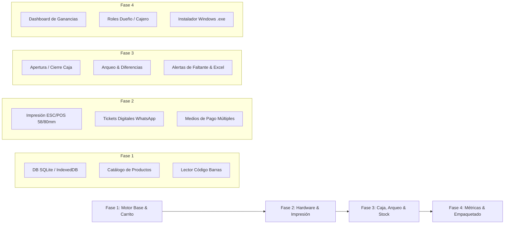

# 📦 Sistema POS & Punto de Venta Local (Software de Caja)
> **Solución Digital Ágil, 100% Offline/Online, Diseñada para Comercios de Barrio y Locales Comerciales.**

---

## 🎯 1. Visión y Propuesta de Valor

El **Software de Caja POS Local** está diseñado específicamente para resolver los dolores de cabeza diarios de dueños y cajeros de comercios de barrio (kioscos, pet shops, rotiserías, almacenes, tiendas de ropa, ferreterías, dietéticas):

- **Cero dependencia de internet obligatorio**: Si se cae la conexión de Fibertel/Telecentro, el local **sigue facturando y cobrando sin parar ni un segundo** (almacenamiento en SQLite local / IndexedDB con sincronización opcional).
- **Cero comisiones mensuales obligatorias**: El comerciante es dueño de su sistema. No paga porcentajes de sus ventas ni mensualidades confiscatorias.
- **Ultra rápido en el mostrador**: Menos de 3 segundos para cobrar una venta con pistola lectora de código de barras.
- **Interfaz moderna y táctil**: Tipografía clara, alto contraste (modo oscuro y claro), teclado numérico grande en pantalla y atajos de teclado para cajeros rápidos.

---

## 🛠️ 2. Arquitectura Técnica Recomendada

| Componente | Tecnología | Justificación |
| :--- | :--- | :--- |
| **Frontend / UI** | Vite + React + Tailwind CSS | Arranque instantáneo, diseño modular, reactividad fluida en pantalla. |
| **Entorno de Escritorio** | Tauri (o Electron liviano) / Web PWA | Aplicación nativa liviana para Windows (pesa menos de 15MB, inicia en 1 segundo y consume 50MB de RAM). |
| **Base de Datos** | SQLite local (cifrado) / Dexie.js (IndexedDB) | Persistencia 100% local en la máquina del comercio con backup en 1 clic. |
| **Integración de Hardware** | WebHID / Serial / Teclado estándar | Compatible con cualquier pistola USB / Bluetooth y ticketeadoras térmicas ESC/POS. |

---

## 🚀 3. Módulos y Funcionalidades Requeridas (100% Operativo)

### 🛒 A. Módulo de Venta en Mostrador (Checkout Rápido)
1. **Soporte Nativo de Pistola Lectora de Código de Barras**:
   - Detección automática en segundo plano (evento de buffer rápido terminado en `Enter`). El cajero no necesita hacer clic previo en ningún input de búsqueda: pistolea el código y el producto se agrega directamente al carrito.
   - Sonido sutil de confirmación ("beep" positivo) al escanear y sonido de alerta ("beep" grave) si el código no está registrado.
   - Si se escanea el mismo producto dos veces, incrementa la cantidad en `+1` automáticamente.
2. **Búsqueda Manual Inteligente**:
   - Barra de búsqueda predictiva con autocompletado en tiempo real por: Nombre, Marca, Categoría o Código interno.
   - Botonera rápida de productos frecuentes / sin código de barras (ej. "Bolsa de consorcio", "Caramelo suelto", "Hielo 2kg", "Fotocopia").
3. **Múltiples Métodos de Cobro**:
   - Efectivo (con calculadora rápida de vuelto automático indicando billetes entregados).
   - Mercado Pago / Transferencia QR (alerta visual de "Verificar acreditación").
   - Tarjetas Débito / Crédito (con recargo o cuotas configurables).
   - "Fiado" / Cuenta Corriente de clientes de confianza (con límite de saldo).
   - Pago mixto (ejemplo: \$10.000 en efectivo y \$8.500 con Mercado Pago).
4. **Manejo de Carritos en Espera**:
   - Botón `[Poner en Espera]` y `[Recuperar Carrito]`: Permite seguir atendiendo a otro cliente si el actual se olvidó la billetera o fue a buscar otro producto a la góndola.
5. **Descuentos y Modificaciones al Vuelo**:
   - Descuento en porcentaje (%) o monto fijo ($) por ítem o al total del ticket.
   - Eliminación rápida de ítems o cambio de cantidad con teclado numérico `*`.

---

### 🧮 B. Arqueo y Cierre de Caja (Totales y Cuadre)
1. **Apertura de Turno de Caja**:
   - Registro de saldo inicial en billetes para cambio/vuelto (ej. "Fondo de caja: $25.000").
   - Identificación del cajero o turno (Mañana / Tarde).
2. **Movimientos de Caja Manuales (Ingresos / Egresos)**:
   - Registro de "Retiro de efectivo" (pago a proveedor de pan, delivery, adelanto de empleado).
   - Registro de "Ingreso de efectivo" (cambio traído del banco).
3. **Cierre de Turno y Arqueo Ciego**:
   - El cajero cuenta el dinero físico y declara los importes:
     - Efectivo contado en billetes.
     - Comprobantes de tarjetas.
     - Transferencias registradas.
   - El sistema compara lo esperado vs. lo declarado y genera el balance:
     - **Diferencia de caja**: `Sobrante (+)` o `Faltante (-)`.
4. **Impresión de Reporte Z / X**:
   - Reporte resumido para imprimir en ticket térmico o exportar en PDF/Excel.

---

### 📦 C. Control de Stock, Costos e Inventario
1. **Gestión de Artículos**:
   - Código de barras (EAN-13, EAN-8 o código interno autogenerado).
   - Nombre, Marca, Rubro/Categoría.
   - **Precio de Costo** vs. **Precio de Venta** (cálculo automático de margen de ganancia %).
   - Stock actual, Stock mínimo (alerta de reposición), Unidad de medida (unidad, gramos, kg).
2. **Alertas Inteligentes de Reposición**:
   - Semáforo visual en el panel:
     - 🔴 **Crítico**: Stock en 0 o negativo.
     - 🟡 **Bajo stock**: Stock menor o igual al mínimo configurado.
     - 🟢 **Óptimo**: Stock suficiente.
   - Botón directo: **"Descargar Lista de Faltantes para Proveedor"** (en PDF o Excel para enviar directo por WhatsApp al mayorista).
3. **Actualización Masiva de Precios (Clave para Argentina)**:
   - Modificación por porcentaje en 1 clic (ejemplo: *"Aumentar 8% a toda la categoría Bebidas"* o *"Aumentar 10% a la marca Royal Canin"*).
   - Importación y exportación bidireccional desde **Excel / CSV** (el comerciante edita en su Excel y lo sube en 2 segundos).
4. **Ajuste de Stock Rápido**:
   - Entradas por compra / factura de proveedor.
   - Salidas por rotura, vencimiento o consumo propio.

---

### 🧾 D. Ticketeadora e Impresión Térmica
1. **Compatibilidad Universal**:
   - Soporte para impresoras térmicas estándar USB de 58mm y 80mm (marcas Xprinter, Epson, POS-58, Gadnic, etc.).
2. **Formato de Ticket Configurable**:
   - Nombre de fantasía del comercio, dirección, teléfono/WhatsApp.
   - Mensaje de pie de ticket personalizable (ej. *"¡Gracias por tu compra! Seguinos en @comercio"*).
   - Detalle de ítems, cantidades, precios, descuento y medio de pago.
3. **Envío de Comprobante por WhatsApp**:
   - En lugar de gastar rollo de papel térmico, botón **"Enviar Ticket por WhatsApp"**: genera un enlace con el detalle de la compra listo para enviar al cliente.

---

### 📊 E. Métricas, Ganancias y Reportes para el Dueño
1. **Métricas en Tiempo Real**:
   - Facturación bruta del día / semana / mes.
   - Ganancia neta real (Venta - Costo).
   - Ticket promedio.
   - Medios de pago más utilizados (% Efectivo vs. % Digital).
2. **Top Productos**:
   - Ranking de los 10 productos más vendidos (volumen).
   - Ranking de los 10 productos que más rentabilidad dejan.
3. **Historial de Ventas y Anulaciones**:
   - Buscador de tickets históricos con detalle de productos.
   - Reimpresión de tickets anteriores.
   - Cancelación / devolución de ventas con reversión automática al inventario de stock.

---

### 🔐 F. Seguridad y Copias de Seguridad (Backups)
1. **Roles y Permisos**:
   - **Administrador / Dueño**: Acceso total (costos, márgenes, ganancias netas, cambios de precios, anulación de tickets).
   - **Cajero / Vendedor**: Solo ventas, consultas de stock y cobro (sin ver costos ni ganancias totales del negocio).
2. **Backups Automáticos en 1 Clic**:
   - Botón `[Crear Copia de Seguridad]`: genera un archivo comprimido `.db` o `.backup` con toda la base de datos de productos y ventas.
   - Opción de sincronizar copia automática en Google Drive o carpeta local de Windows.

---

## 🎨 4. Principios de Diseño de Interfaz (UI/UX)

- **Modo Oscuro Predeterminado (Dark Mode)**: Reduce el cansancio visual del personal durante jornadas largas de 8 a 12 horas frente al mostrador.
- **Teclas Rápidas (Shortcuts) para velocidad**:
  - `F1` o `Barra Espaciadora`: Buscar producto.
  - `F2`: Cobrar / Finalizar venta.
  - `F3`: Poner venta en espera.
  - `F4`: Abrir cajón de dinero.
  - `Esc`: Cancelar / Limpiar carrito.
- **Fuentes Tipográficas Grandes**: Los precios y totales deben verse claramente desde una distancia de 1 metro.

---

## 📅 5. Hoja de Ruta de Implementación (Roadmap)

---

## 💰 6. Estrategia de Venta al Comercio

- **Precio de Venta Base Recomendado**:
  - **Setup / Instalación Única**: **USD 80** (~$124.000 ARS) incluyendo carga inicial de productos desde su lista o Excel y configuración de su lectora de código de barras.
  - **Abono Opcional de Soporte / Respaldo en la Nube**: **USD 15 - 22 / mes** (mantenimiento, copias de seguridad en la nube y soporte prioritario por WhatsApp).
- **Argumento de Venta (Anclaje)**:
  - *"Un software tradicional te cobra licencias mensuales caras o comisiones por venta. Este sistema es tuyo, funciona rápido en tu computadora actual aunque no tengas internet, y te ahorra horas de conteo de caja y pérdida de mercadería."*
