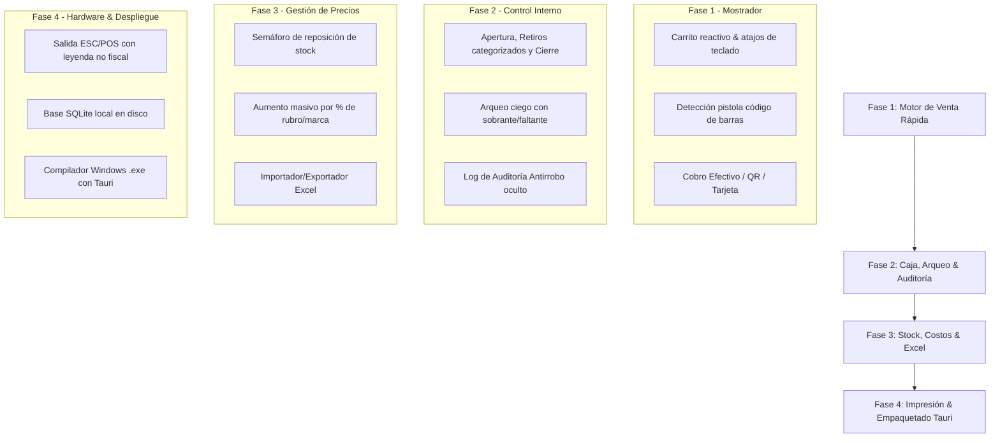

# 📦 Sistema POS & Punto de Venta Local (Software de Caja)
> **Solución Digital Ágil, 100% Offline con Persistencia Robusta en Windows, Diseñada para el Control Interno de Comercios de Barrio y Locales Comerciales.**

---

## 🎯 1. Visión y Propuesta de Valor

El **Software de Caja POS Local** está diseñado para resolver los tres dolores de cabeza reales de los dueños de comercios (kioscos, pet shops, rotiserías, almacenes, tiendas de ropa, ferreterías, dietéticas):

1. **Control Interno y Prevención de Fugas ("Antirrobo")**: Registro ciego y transparente de lo que pasa en el mostrador cuando el dueño no está físicamente en el local.
2. **Cero Dependencia de Internet para Cobrar**: Si se corta internet, el local **sigue vendiendo, escaneando y cobrando sin detenerse** gracias a su motor SQLite local en disco duro.
3. **Cero Comisiones por Venta**: El comerciante es dueño absoluto de su sistema y de sus datos, sin costos ocultos por operación.

---

## 🛠️ 2. Arquitectura Técnica y Estrategia de Entrega

Para garantizar que el comerciante jamás pierda datos y a la vez tener un producto fácil de vender, se utiliza una arquitectura en dos capas:

| Capa | Tecnología | Propósito |
| :--- | :--- | :--- |
| **Instalación en el Local (Producción)** | **Tauri + React + SQLite local** | Aplicación de escritorio nativa para Windows (`.exe` ultra liviano < 15MB). Consume apenas 50MB de RAM. Base de datos física real `.db` en disco (inmune a limpiezas de navegador o formateos de cookies). |
| **Demo Online de Ventas (Comercial)** | **Web SPA / Vite** | Versión demostrativa alojada en la web para que el comerciante pruebe la velocidad de escaneo y el arqueo desde su celular o PC antes de comprar sin instalar nada. |
| **App Móvil del Dueño (Abono Opcional)** | **Sincronización P2P / Supabase** | Sincronización en segundo plano de tickets y métricas para que el dueño consulte las ventas en vivo desde su teléfono. |
| **Integración de Hardware** | **Drivers Windows / WebHID / ESC-POS** | Pistolas lectoras USB/Bluetooth (emulación de teclado) e impresoras térmicas de tickets (58mm y 80mm). |

---

## 🚀 3. Módulos y Funcionalidades Requeridas (100% Operativo)

### 🛒 A. Módulo de Venta en Mostrador (Checkout Rápido)
1. **Soporte Nativo de Pistola Lectora de Código de Barras**:
   - Detección en segundo plano (buffer veloz terminado en `Enter`). El cajero no necesita hacer clic en ningún campo de búsqueda: pasa el producto por la pistola y entra directo al ticket.
   - Sonidos diferenciados: *Beep positivo* al escanear correctamente y *Alerta sonora* si el código no existe en el catálogo.
   - Lectura reiterada: Escanear el mismo código consecutivamente incrementa la cantidad en `+1` de forma inmediata.
2. **Búsqueda Manual Asistida**:
   - Buscador predictivo por Nombre, Marca o Código interno.
   - Botonera de acceso rápido para ítems frecuentes sin código de barras (ej. "Bolsa de consorcio", "Hielo 2kg", "Fotocopia", "Caramelo suelto").
3. **Métodos de Cobro Admitidos (Cobro Inmediato - Cero Deuda)**:
   - **Efectivo**: Calculadora integrada de vuelto en pantalla con atajos de billetes comunes para agilizar la entrega.
   - **Mercado Pago / Transferencia QR**: Validación visual con confirmación de acreditación.
   - **Tarjetas de Débito y Crédito**: Registro de operación y número de cupón/lote.
   - **Cobro Mixto**: Posibilidad de fraccionar el pago (ejemplo: \$15.000 en efectivo y \$10.000 por transferencia).
   *(Nota: Se excluyen cuentas corrientes y fiado para fomentar el cobro al contado y evitar desajustes en el arqueo).*
4. **Manejo de Carritos en Espera**:
   - Botón `[Venta en Espera]` y `[Recuperar Venta]`: Permite continuar cobrando a otros clientes si alguien fue a buscar otro producto a la góndola o busca dinero extra.
5. **Modificación Ágil de Ítems**:
   - Teclas de acceso rápido (`*` para multiplicar cantidades, `Supr` para quitar línea).

---

### 🛡️ B. Log de Auditoría Antirrobo (Registro Oculto de Eventos)
Módulo exclusivo para el dueño que registra en silencio cualquier acción sensible en la caja:
- **Anulaciones de Venta**: Registra fecha, hora, cajero e importe del ticket descartado.
- **Eliminación de Productos del Carrito**: Queda asentado si un producto fue escaneado y luego borrado antes de finalizar el cobro.
- **Modificaciones Manuales de Precio**: Alerta si el cajero alteró el precio fijado por el sistema.
- **Aperturas de Cajón de Dinero sin Venta**: Notifica cada vez que se disparó la apertura manual del cajón portabilletes.

---

### 🧮 C. Arqueo y Cierre de Turno de Caja (Control Ciego)
1. **Apertura de Caja**:
   - Carga del fondo inicial de cambio/sencillo (ej. "Fondo inicial: $30.000").
   - Identificación del cajero y turno (Mañana / Tarde / Turno Completo).
2. **Categorización Estandarizada de Retiros (Egresos de Efectivo)**:
   Permite asentar salidas de dinero en segundos sin desbalancear la caja:
   - 🚚 **Pago a Proveedores**: Mercadería que llega al local (panadero, distribuidora de gaseosas, etc.).
   - 🧹 **Gastos Operativos del Local**: Limpieza, bolsas, viáticos, hielo.
   - 💵 **Adelantos de Sueldo**: Retiros autorizados al personal.
   - 👤 **Retiros del Dueño**: Dinero retirado de las ventas del día.
3. **Arqueo Ciego de Cierre**:
   - El cajero cuenta el dinero físico y declara los montos sin que el sistema le diga de antemano cuánto debería haber.
   - Una vez cargados los datos, el sistema cruza lo esperado vs. lo declarado y emite el balance:
     - **Diferencia de caja**: `Sobrante (+)` o `Faltante (-)`.
4. **Resumen de Turno Imprimible**:
   - Desglose por método de cobro (Efectivo, MP/QR, Tarjeta) + detalle de retiros autorizados.

---

### 📦 D. Control de Inventario, Costos y Reposición
1. **Gestión de Artículos**:
   - Código de barras (EAN-13, EAN-8 o código interno).
   - Nombre, Rubro/Categoría y Marca.
   - **Precio de Costo** vs. **Precio de Venta** (cálculo de margen comercial %).
   - Stock actual y Stock mínimo para alerta temprana.
2. **Semáforo de Reposición**:
   - 🔴 **Crítico**: Stock en 0 o negativo.
   - 🟡 **Bajo stock**: Stock en o por debajo del mínimo fijado.
   - 🟢 **Óptimo**: Stock en niveles saludables.
   - **Exportación en 1 Clic**: Genera la lista de reposición lista para enviar por WhatsApp al distribuidor.
3. **Actualización Masiva de Precios (Clave ante Inflación)**:
   - Aumento porcentual por Rubro o Marca en un clic (ej. *"Aumentar 8% a todas las gaseosas"*).
   - Importación y exportación masiva bidireccional desde **planillas Excel / CSV**.

---

### 🧾 E. Impresión de Tickets y Blindaje Legal
1. **Ticketeadoras Térmicas (58mm y 80mm)**:
   - Conexión USB directa sin configuración engorrosa.
   - Detalle claro de ítems, cantidades, totales y medios de pago.
2. **Blindaje Legal Obligatorio**:
   - Todos los comprobantes impresos llevan al pie la leyenda en negrita:  
     `DOCUMENTO NO VÁLIDO COMO FACTURA - USO EXCLUSIVO DE CONTROL INTERNO`
   - Se elimina de la interfaz el uso de términos fiscales (ej. "Facturación"), reemplazándolos por **"Total de Ventas"** o **"Registro de Ingresos"**.
3. **Comprobante Digital vía WhatsApp**:
   - Opción ecológica y moderna para enviar el detalle de compra directo al chat del cliente.

---

### 📊 F. Métricas y Panel del Negocio (Vista del Dueño)
1. **Indicadores Clave**:
   - Total de ventas del día / semana / mes.
   - Ganancia bruta estimada (Precio de Venta - Costo).
   - Ticket promedio.
   - Distribución de medios de cobro (% Efectivo vs. % Digital).
2. **Top Ventas**:
   - Productos con mayor rotación (más vendidos).
   - Productos con mayor margen de rentabilidad.
3. **Historial de Operaciones**:
   - Búsqueda de tickets pasados por fecha, cajero o medio de pago.
   - Reimpresión de comprobantes internos.

---

### 🔐 G. Perfiles y Permisos de Acceso

- **Rol Vendedor (Operación Ciega)**:
  - Solo permite escanear productos, cobrar, aplicar carritos en espera y realizar el arqueo ciego al final del turno.
  - No puede ver costos de compra, ganancias totales del negocio, ni métricas globales.
- **Rol Administrador / Dueño**:
  - Acceso irrestricto al Log de Auditoría Antirrobo, edición de costos, aumentos masivos de precios, métricas y copias de seguridad.

---

## 📅 4. Hoja de Ruta de Desarrollo (Roadmap)

---

## 💰 5. Modelo Comercial y Argumento de Venta

- **Puesta en Marcha / Setup Inicial**: **USD 80** (~$124.000 ARS)
  - Incluye: Instalación del software en la computadora del local, configuración de la pistola lectora, carga inicial de productos desde Excel y capacitación de 15 minutos al personal.
- **Abono Mensual de Valor Agregado**: **USD 15 - 20 / mes**
  - **Propuesta irresistible**: *"App del Dueño en el Celular + Copia de Seguridad Automática"*.
  - El dueño puede ver desde su teléfono en tiempo real cuánto va recaudando el local minuto a minuto, mientras sus datos quedan respaldados de forma automática.
- **Anclaje de Venta**:
  - *"Los sistemas de abono tradicionales te cobran comisiones por venta o te dejan colgado si se corta internet. Este sistema es tuyo, corre en tu computadora a máxima velocidad y te da el control exacto de cada peso que entra y sale de la caja."*
